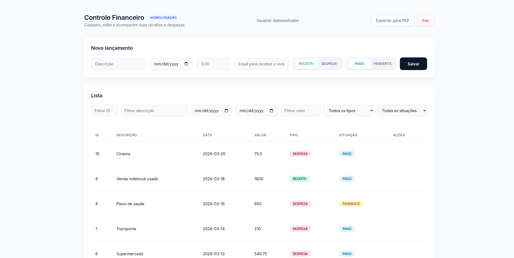

# Expenses

Lightweight fullstack expense-tracking app (TypeScript / Node.js) with a CI/CD-first workflow.



## Project Focus

This repository is organized for continuous integration and continuous delivery. Key goals:

- Run tests and report coverage on every push/PR.
- Build and publish container images from CI.
- Run database migrations and smoke tests in pipeline stages.

## Repo Layout

- Server code: `src/` (controllers, services, routes)
- Migrations: `migrations/` and initial SQL in `sql/init.sql`
- Tests: `src/__tests__/` (Jest)
- Docker: `Dockerfile` and `docker-compose*.yml`

## Stack

Core technologies used in this project:

- Node.js (runtime)
- TypeScript (language)
- Express (HTTP server)
- Drizzle ORM / drizzle-kit (DB migrations & ORM)
- PostgreSQL
- Jest (tests)
- ESLint (linter)
- Docker / Docker Compose (containerization)
- Utilities: `dotenv`, `nodemailer`, `pdfkit`

## Architecture


## Getting Started

Quick steps to get the project running locally:

1. Clone the repo:

```bash
git clone <repo-url>
cd expenses
```

2. Install dependencies:

```bash
npm ci
```

3. Configure environment:

- Copy or create a `.env` file in the project root with at least a `DATABASE_URL` pointing to a Postgres instance. See `src/config.ts` for config keys.

4. Run database migrations and seed (if needed):

```bash
npm run db:migrate
npm run db:seed
```

5. Run in development mode:

```bash
npm run dev
```

6. Run tests:

```bash
npm test
```

## Secrets & Environment

CI pipelines will need secrets/configuration for:

- `DATABASE_URL` (or individual DB credentials)

Keep secrets in your CI provider's secret store (GitHub Secrets, GitLab CI variables, etc.).

