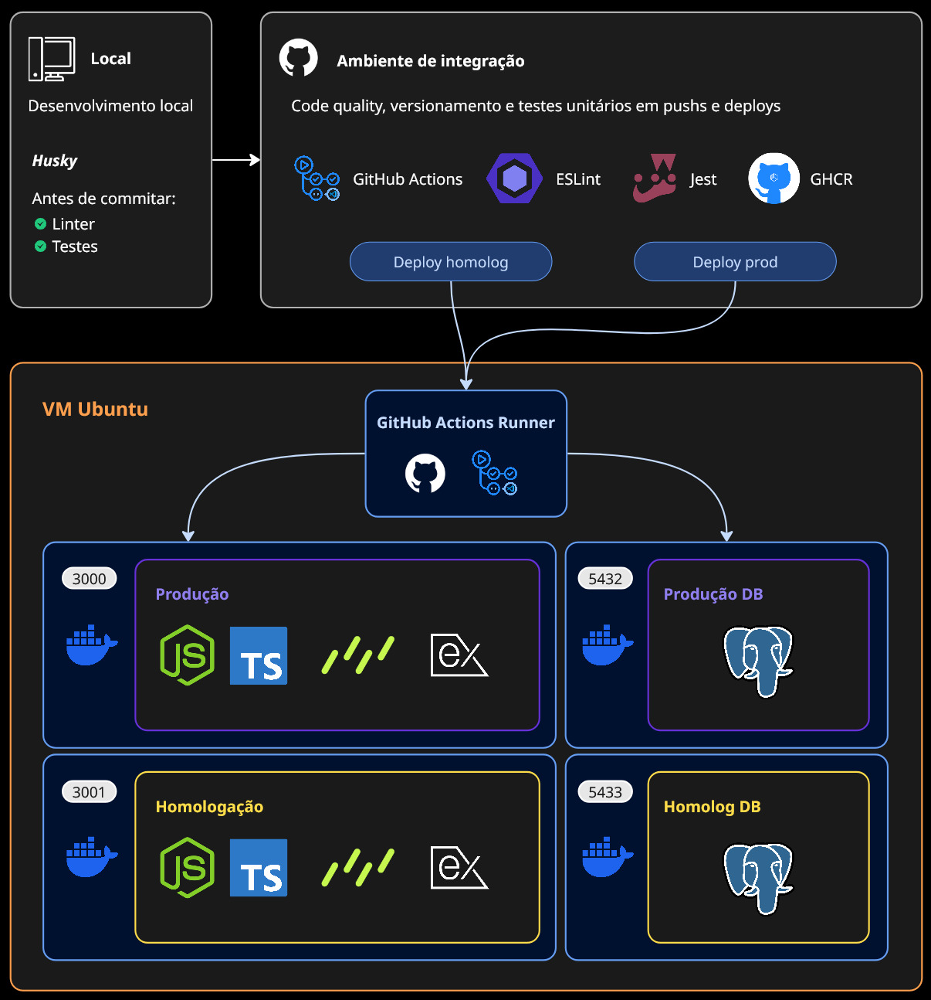

# Expenses

Lightweight fullstack expense-tracking app (TypeScript / Node.js) with a CI/CD-first workflow.

## Project Focus

This repository is organized for continuous integration and continuous delivery. Key goals:

- Run tests and report coverage on every push/PR.
- Build and publish container images from CI.
- Run database migrations and smoke tests in pipeline stages.

## Repo Layout

- Server code: `src/` (controllers, services, routes)
- Migrations: `migrations/` and initial SQL in `sql/init.sql`
- Tests: `src/__tests__/` (Jest)
- Docker: `Dockerfile` and `docker-compose*.yml`

## Stack

Core technologies used in this project:

- Node.js (runtime)
- TypeScript (language)
- Express (HTTP server)
- Drizzle ORM / drizzle-kit (DB migrations & ORM)
- PostgreSQL
- Jest (tests)
- ESLint (linter)
- Docker / Docker Compose (containerization)
- Husky (pre-commit automation)
- GitHub Actions workflows
- Utilities: `dotenv`, `nodemailer`, `pdfkit`,

## Getting Started

Quick steps to get the project running locally:

1. Clone the repo:

```bash
git clone <repo-url>
cd expenses
```

2. Install dependencies:

```bash
npm ci
```

3. Configure environment:

- Copy or create a `.env` file in the project root with at least a `DATABASE_URL` pointing to a Postgres instance. See `src/config.ts` for config keys.

4. Run database migrations and seed (if needed):

```bash
npm run db:migrate
npm run db:seed
```

5. Run in development mode:

```bash
npm run dev
```

6. Run tests:

```bash
npm test
```

## Architecture


## CI/CD (recommended)

Below are the recommended CI steps to implement in your pipeline (GitHub Actions / GitLab CI / other):

1. Install: `npm ci`
2. Test: `npm test` and collect coverage
3. Build: `npm run build` (if applicable)
4. Containerize: build Docker image and push to registry
5. Migrations & Smoke tests: run DB migrations in an ephemeral DB and run quick integration checks
6. Deploy: promote image to staging/production using your deployment system

### Example: GitHub Actions (snippet)

```yaml
name: CI
on: [push, pull_request]
jobs:
	build-test:
		runs-on: ubuntu-latest
		steps:
			- uses: actions/checkout@v4
			- uses: actions/setup-node@v4
				with:
					node-version: '18'
			- run: npm ci
			- run: npm test -- --coverage

	docker-build:
		needs: build-test
		runs-on: ubuntu-latest
		steps:
			- uses: actions/checkout@v4
			- name: Registry login
				run: |
					# Configure registry login here using your CI secret names
					echo "Configure registry login in CI"
			- run: |
					docker build -t my-registry/expenses:latest .
					docker push my-registry/expenses:latest
```

## Secrets & Environment

CI pipelines will need secrets/configuration for:

- `DATABASE_URL` (or individual DB credentials)

Keep secrets in your CI provider's secret store (GitHub Secrets, GitLab CI variables, etc.).

## Local development

Install dependencies and run locally:

```bash
npm install
npm run dev
```

Run the test suite locally:

```bash
npm test
```

## Docker & Compose

Build locally:

```bash
docker build -t expenses:local .
```

Bring up containers with Compose:

```bash
docker-compose up --build
```

## Migrations

Apply migrations during CI or locally using your DB tooling. The SQL and migration files live under `migrations/` and `sql/`.
